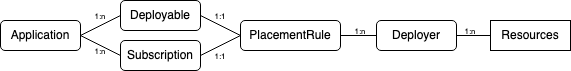

# Dcouments for Hybrid Application Model

<!-- START doctoc generated TOC please keep comment here to allow auto update -->
<!-- DON'T EDIT THIS SECTION, INSTEAD RE-RUN doctoc TO UPDATE -->
**Table of Contents**  *generated with [DocToc](https://github.com/thlorenz/doctoc)*

- [What's New](#whats-new)
- [Motications](#motications)
  - [Assumptions](#assumptions)
- [Overview](#overview)
- [Specifications](#specifications)
  - [core](#core)
  - [tools](#tools)
  - [installation](#installation)
  - [integration](#integration)
- [Community](#community)

<!-- END doctoc generated TOC please keep comment here to allow auto update -->

## What's New

Hello, world!

## Motivations

Container platforms has become an integral part of modern IT landscape, but the majority of the systems in the world are still built on legacy technologies. Here we introduce a hybrid application model to improve the management efficiency of assets across various platforms (containers, virtual machines, cloud services, ...)

### Assumptions

This model is implemented in kubernetes with its Custom Resource technology, and leverages other assets in kubernetes. This leads to the following 2 points

- Hybrid Application Model follows the kubernetes convention in defining resources
- Custom Resources and operators/controllers need to be provided to work with non k8s systems.

## Overview

The goal of this model is to provide a common way to define resources of hybrid application with their deployment information, so that they can be discovered or distributed across systems and managed in a centralized way. 

Term "Application" in this model refers to a group of resources, those resources are managed in various systems (kubernetes, openstack, manageiq, cloud services, ... ) and are represented by native or custom resources in kubernetes. The Application definition from Kubernetes Special Interest Group serves this purpose well, **Application** is the first resource we introduce into hybrid application model.

In order to model kubernetes resource in a kubernetes system without impacting that kubernetes system, "wrapper" resource are needed. Depending on the actual location of resource, we introduce **Deployable** and **Subscription** to represent the cases where the resource is inside it vs in a place pointed by it.

To deploy or discover resources for hybrid application **Deployer** are needed. There are many assets developed in community for that, our hybrid application model is integrating with them and to simplify the life of application dev/ops.

The last but least resource in hybrid application model is **PlacementRule**, it defines which **Deployer**(s) the **Deployable** / **Subscription** is deploying to.  

The 5 resources above are the [core](core/README.md) of the hybrid application model. Based on them, [tools](tools/README.md) are developed to facilitate.

## Specifications

This specification consists of fllowing sections:

### core

The core section defines the essential resources to describe hybrid environment and the resources in it. All custom resources introduced in this section sit in `core.hybridapp.io` group. 

### tools

The tools section defines useful tools to facilitate the usage of hybrid application model. All custom resources introduced in this section sit in `tools.hybridapp.io` group.

### installation

The installation section describes how to deploy this model into a hybrid environment

### integration

The integration section defines how this model interacts with those systems managing actual resources. 

## Community
